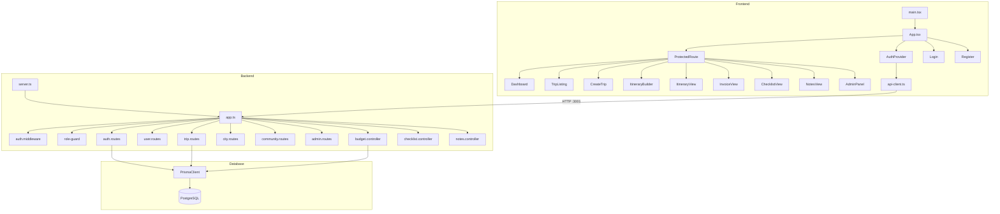

# GRAPH_REPORT.md — Traveloop

**Status:** Active build — Phase 4 (Parallel Build)  
**Generated:** 2026-05-10 11:10 IST  
**Agent:** Opus (auto-generated from codebase scan)

---

## Codebase Structure

```
Traveloop/
├── PROJECT_MEMORY.md              # Central coordination doc (§0-§8)
├── Traveloop_PRD.md               # Product Requirements (895 lines)
├── graphify-out/
│   └── GRAPH_REPORT.md            # This file
├── design-system/
│   └── MASTER.md                  # Design token definitions
├── .planning/                     # 15 files (10 module plans + 4 contracts + architecture)
│
├── apps/
│   ├── api/                       # Backend — Express 5 + TypeScript + Prisma
│   │   ├── .env                   # DB URL, JWT secret, port
│   │   ├── package.json           # Dependencies locked
│   │   ├── tsconfig.json
│   │   ├── vitest.config.ts
│   │   ├── prisma/
│   │   │   ├── schema.prisma      # 11 models, all relations, indexes
│   │   │   └── seed.ts            # City + Activity seed data
│   │   ├── uploads/               # Profile/cover photo storage
│   │   └── src/
│   │       ├── server.ts          # Entry point (port 3001)
│   │       ├── app.ts             # Express app factory, all route mounts
│   │       ├── lib/
│   │       │   ├── prisma.ts      # Singleton Prisma client
│   │       │   ├── response.ts    # ok(), err(), ErrorCodes
│   │       │   └── qs.ts          # Query string helpers
│   │       ├── middleware/
│   │       │   ├── auth.middleware.ts    # JWT authenticate + optionalAuth
│   │       │   ├── role-guard.ts        # requireRole('admin')
│   │       │   ├── error-handler.ts     # Global error handler + notFound
│   │       │   └── upload.middleware.ts  # Multer file upload
│   │       ├── modules/
│   │       │   ├── auth/         # register, login, logout, me
│   │       │   │   ├── auth.service.ts
│   │       │   │   ├── auth.controller.ts
│   │       │   │   ├── auth.routes.ts
│   │       │   │   └── auth.test.ts
│   │       │   ├── user/         # profile CRUD + photo upload
│   │       │   │   ├── user.service.ts (implied)
│   │       │   │   └── user.routes.ts
│   │       │   ├── trip/         # CRUD + itinerary + publish/unpublish + copy
│   │       │   │   ├── trip.service.ts (256 lines)
│   │       │   │   ├── trip.controller.ts
│   │       │   │   ├── trip.routes.ts
│   │       │   │   └── section.service.ts
│   │       │   ├── city/         # Cities + Activities + section-activity linking
│   │       │   │   ├── city.service.ts
│   │       │   │   └── city.controller.ts
│   │       │   ├── budget/       # Budget items + Invoice + PDF gen
│   │       │   │   ├── budget.service.ts (219 lines, Puppeteer PDF)
│   │       │   │   ├── budget.controller.ts
│   │       │   │   └── budget.routes.ts
│   │       │   ├── checklist/    # Packing items CRUD + reset
│   │       │   │   └── checklist.controller.ts + service
│   │       │   ├── notes/        # Trip notes CRUD
│   │       │   │   └── notes.controller.ts + service
│   │       │   ├── community/    # Public feed + slug view + view counting
│   │       │   │   ├── community.service.ts
│   │       │   │   ├── community.controller.ts
│   │       │   │   └── community.routes.ts
│   │       │   └── admin/        # User mgmt + analytics + popular cities/activities
│   │       │       ├── admin.service.ts (4518 bytes)
│   │       │       ├── admin.controller.ts
│   │       │       └── admin.routes.ts
│   │       └── __tests__/
│   │           ├── business-logic.test.ts
│   │           └── setup.ts
│   │
│   └── web/                       # Frontend — React 19 + Vite + TailwindCSS
│       ├── package.json           # Dependencies locked
│       ├── vite.config.ts         # Proxy to :3001 (FIXED by Opus audit)
│       ├── index.html             # SPA entry
│       ├── tailwind.config.js
│       ├── components.json        # shadcn/ui config
│       └── src/
│           ├── main.tsx           # BrowserRouter + StrictMode
│           ├── App.tsx            # Route definitions (11 routes)
│           ├── App.css            # Global styles
│           ├── index.css          # Tailwind directives
│           ├── lib/
│           │   ├── api-client.ts  # Fetch wrapper (credentials: include FIXED)
│           │   ├── auth-context.tsx # AuthProvider + useAuth hook
│           │   └── utils.ts       # cn() helper
│           ├── components/
│           │   ├── ProtectedRoute.tsx    # Auth gate via Outlet
│           │   ├── SearchBar.tsx         # Destination search
│           │   ├── SearchBar.test.tsx
│           │   ├── SectionCard.tsx       # Itinerary section card
│           │   └── SectionCard.test.tsx
│           └── pages/             # 11 pages + 11 test files
│               ├── Login.tsx + .test.tsx
│               ├── Register.tsx + .test.tsx
│               ├── Dashboard.tsx + .test.tsx
│               ├── CreateTrip.tsx + .test.tsx
│               ├── TripListing.tsx + .test.tsx
│               ├── ItineraryBuilder.tsx + .test.tsx
│               ├── ItineraryView.tsx + .test.tsx
│               ├── InvoiceView.tsx + .test.tsx
│               ├── AdminPanel.tsx + .test.tsx
│               ├── ChecklistView.tsx + .test.tsx
│               └── NotesView.tsx + .test.tsx
```

## Dependency Graph



## Coverage Matrix

| Module | Backend Service | Controller | Routes | Frontend Page | Frontend Test | Backend Test |
|--------|:-:|:-:|:-:|:-:|:-:|:-:|
| Auth | ✅ | ✅ | ✅ | ✅ Login + Register | ✅ | ✅ |
| User | ✅ | ✅ | ✅ | ✅ ProfileEdit | ✅ | — |
| Trip | ✅ | ✅ | ✅ | ✅ Dashboard + TripListing + CreateTrip | ✅ | ✅ biz logic |
| Sections | ✅ | ✅ | ✅ | ✅ ItineraryBuilder | ✅ | — |
| City/Activity | ✅ | ✅ | ✅ | (in CreateTrip) | — | — |
| Budget/Invoice | ✅ | ✅ | ✅ | ✅ InvoiceView | ✅ | — |
| Checklist | ✅ | ✅ | ✅ | ✅ ChecklistView | ✅ | — |
| Notes | ✅ | ✅ | ✅ | ✅ NotesView | ✅ | — |
| Community | ✅ | ✅ | ✅ | ✅ CommunityFeed + PublicTripView | ✅ | — |
| Admin | ✅ | ✅ | ✅ | ✅ AdminPanel | ✅ | — |

## Identified Gaps

All gaps have been resolved:
1. ~~**Community frontend pages** — No CommunityFeed.tsx or PublicTripView.tsx (PRD Screen 7 + 8)~~ -> Fixed: Pages created and tested.
2. ~~**Profile page** — No dedicated profile edit page (PRD Screen 10)~~ -> Fixed: ProfileEdit.tsx created and tested.
3. ~~**No docker-compose.yml** — GPT was blocked; may now have created it~~ -> Fixed: Added by Opus.
4. ~~**No root package.json** — No monorepo workspace orchestration~~ -> Fixed: Added by Opus.
5. ~~**No `test` script in web/package.json** — Frontend tests exist but can't be run~~ -> Fixed: Added by Opus and tests pass.
